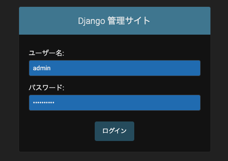
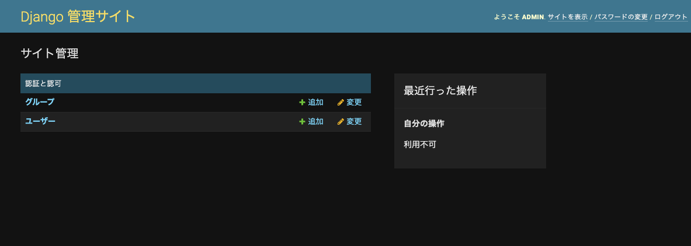

## Start Project

### 1. Creat project

- admin: <site name> --> backend

```bash
docker-compose run web django-admin startproject backend .
```

### 2. Creat app

2-1. appname: note

```bash
$ python manage.py startapp <app name>

$ tree note
note/
├── __init__.py
├── admin.py
├── apps.py
├── migrations
│   └── __init__.py
├── models.py
├── tests.py
└── views.py
```

2-2. create `urls.py`

### 3. migrate

```bash
$ python manage.py migrate

# >>>
Operations to perform:
  Apply all migrations: admin, auth, contenttypes, sessions
Running migrations:
  Applying contenttypes.0001_initial... OK
  Applying auth.0001_initial... OK
  Applying admin.0001_initial... OK
  Applying admin.0002_logentry_remove_auto_add... OK
  Applying admin.0003_logentry_add_action_flag_choices... OK
  Applying contenttypes.0002_remove_content_type_name... OK
  Applying auth.0002_alter_permission_name_max_length... OK
  Applying auth.0003_alter_user_email_max_length... OK
  Applying auth.0004_alter_user_username_opts... OK
  Applying auth.0005_alter_user_last_login_null... OK
  Applying auth.0006_require_contenttypes_0002... OK
  Applying auth.0007_alter_validators_add_error_messages... OK
  Applying auth.0008_alter_user_username_max_length... OK
  Applying auth.0009_alter_user_last_name_max_length... OK
  Applying auth.0010_alter_group_name_max_length... OK
  Applying auth.0011_update_proxy_permissions... OK
  Applying auth.0012_alter_user_first_name_max_length... OK
  Applying sessions.0001_initial... OK
```

### 4. [Creating an admin user](https://docs.djangoproject.com/en/4.0/intro/tutorial02/#creating-an-admin-user)

4-1. command
```bash
$ python manage.py createsuperuser

# >>>
ユーザー名 (leave blank to use 'root'): admin
メールアドレス: admin@example.com
Password:
Password (again):
Superuser created successfully.

# access
# http://0.0.0.0:8000/admin/
```

4-2. input form & push login

  

4-3. Dashbord

  

## Ref

- https://docs.djangoproject.com/en/4.0/intro/tutorial01/
